# **Solution accelerator for Fabric platform to monitor cost**

The solution aims to facilitate the understanding and monitoring of the Microsoft Fabric Cost.

Customers may not always clearly distinguish between costs that are included or excluded within the Data Platform, the handling of reservations (particularly those not rationalized within a defined scope), or their capacity usage. They may also need guidance on strategies for optimizing resources and implementing effective FinOps practices, including chargeback and show back to stakeholders. This free solution was developed in France by several passionate CSA experts in FinOps and Data: [Cedric Dupui](https://www.linkedin.com/in/cdupui/), [Manel Omani](https://www.linkedin.com/in/mlomani/), [Antoine Richet](https://www.linkedin.com/in/antoine-richet-22a44021/), and led by [Romain Casteres](https://www.linkedin.com/in/casteres/) inspired by his Blog article [FinOps for Microsoft Fabric](https://www.linkedin.com/pulse/finops-microsoft-fabric-romain-casteres-hc6ee/?trackingId=xFSs0xHqR0OheUQ7Tqn9mw%3D%3D).

## Introduction

Fabric Cost Analysis (short: FCA) is a solution to enable holistic monitoring of Microsoft Fabric Cost with the help of Microsoft Fabric.

FCA has the goal to provide a holistic view specified on Microsoft Fabric aspects and particularities (joining Financial and Operational forces) on top of the various information, which can be extracted from Azure Cost Management, personal enriched source of information, … allowing its users to analyze at a very high level, but also to deep dive into specific usage, reservations and particularity of the platform for a more finer data analysis.

FCA is fully developed utilizing Fabric capabilities, with Pipelines and Notebooks serving as key tools for data extraction and transformation. Data is maintained both in its raw format and as Delta Parquet, allowing users to access it directly through Power BI Direct Lake. FCA includes standard reports that provide an overview of data and allow users to customize or create their own reports using the data model. Fabric's open platform enables integration with external data sources for further analysis as needed.

⚠️ Caution: The FCA solution accelerator is not an official Microsoft product! It is a solution accelerator, which can help you implement a cost monitoring solution within and for Fabric. Consequently, there is no official support provided, and there remains a potential risk of failures.

## Content

> 🏗️ The solution is still in Preview and may receive major updates.

### Architecture

### FCA Inputs

FCA gathers diverse data in Lakehouse to provide cost insights:
- FCA extracts Azure Cost in [FOCUS](https://focus.finops.org/) format (a Unified Standard for Cloud Billing Data)
- FCA extracts enriched Microsoft Learn documentation data
- (optional) FCA extracts Azure Reservations details

ℹ️ Azure Cost export is available for various Azure account types, including Enterprise Agreement (EA) and Microsoft Customer Agreement (MCA) customers. To view the full list of supported account types, see [Understand Cost Management data](https://learn.microsoft.com/en-us/azure/cost-management-billing/costs/understand-cost-mgt-data).

### FCA Outputs

#### Report

| **Page Name** | FinOps Phase [🔗](https://learn.microsoft.com/en-us/cloud-computing/finops/framework/finops-framework#lifecycle) | **Purpose**                                                     | **Sample**                                                     |
| ----- | ------------------------------------------------------------ | ------------------------------------------------------------ | ------------------------------------------------------------ |
| **Home** | Inform | The page presents a summary of key financial metrics, some of which are already included in the cost of capacity, while others are not | Savings Benefits due to RI 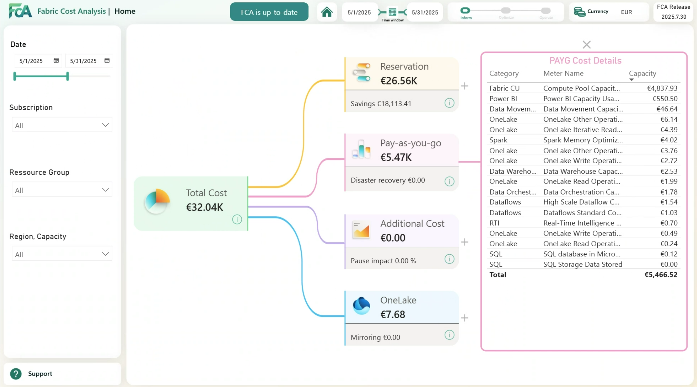 Effect of pausing a capacity having throttling 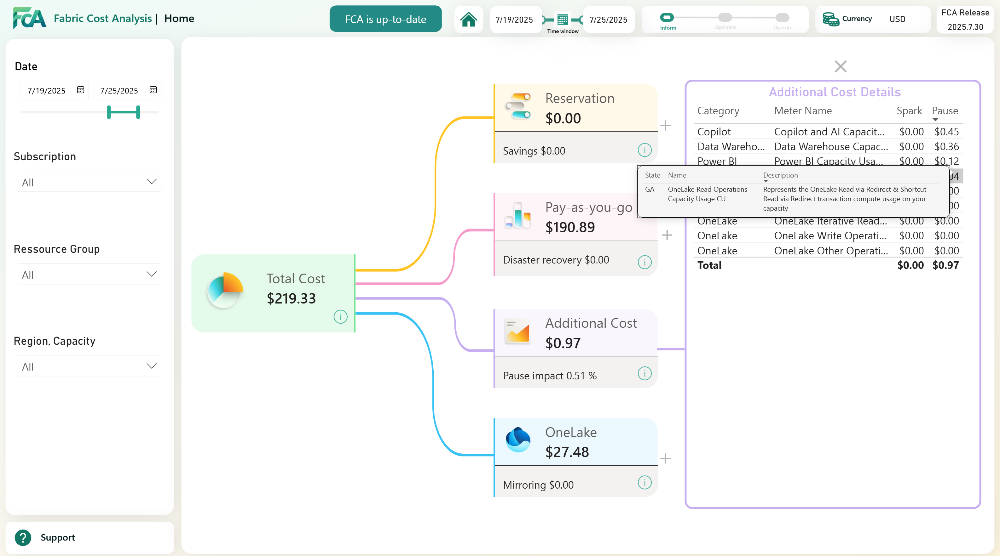 |
| **Summary** | Inform | The page provides an overview of cost per capacities across different regions, helping stakeholders to understand cost distributions and resource allocations within a specified timeframe | 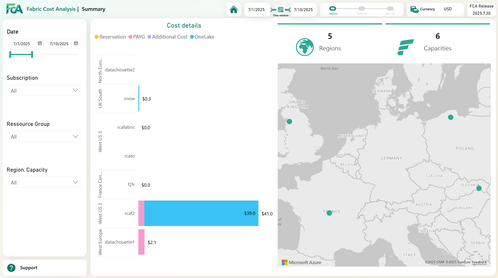 |
| **Capacity Usage** | Optimize | The page is designed to enhance efficiency by illustrating how capacity is being utilized, enabling stakeholders to monitor and optimize resource allocation effectively | 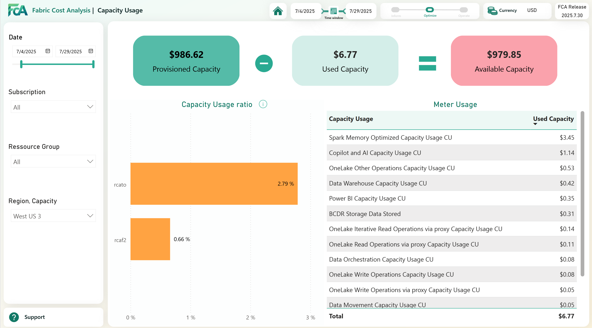 |
| **Reservation** | Optimize | The page aims to reduce cloud waste by providing a comprehensive view of reservation-related data to verify the total usage of the reservation across the different capacities and a specified timeframe | 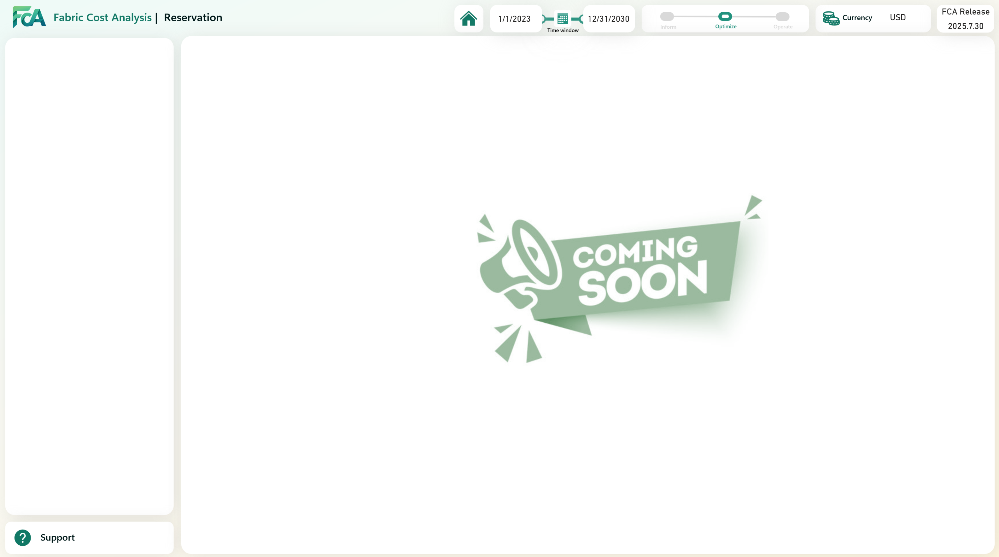 |
| **Cost Detail** | Operate | The page offers a detailed view of cost distributions across different categories and resources and includes Year-to-Date calculations to help stakeholders to define, track, and monitor expenses effectively | 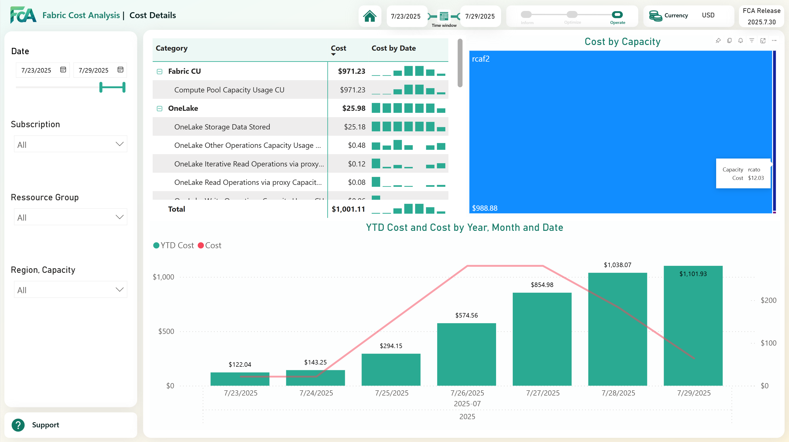 |
| **Support** |                                                              | This page is designed to facilitate the learning and comprehension of the specific aspects of fabric costs and the contents of this report. | 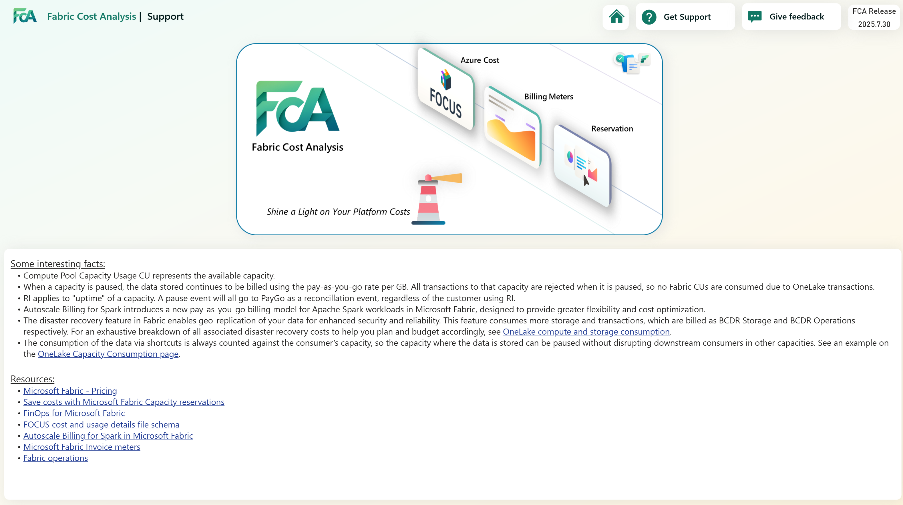 |

#### Data Agent

With a Data Agent on top of the FCA semantic model you can query in natural language Fabric Cost.

The following provides an example of communication in both English and French.

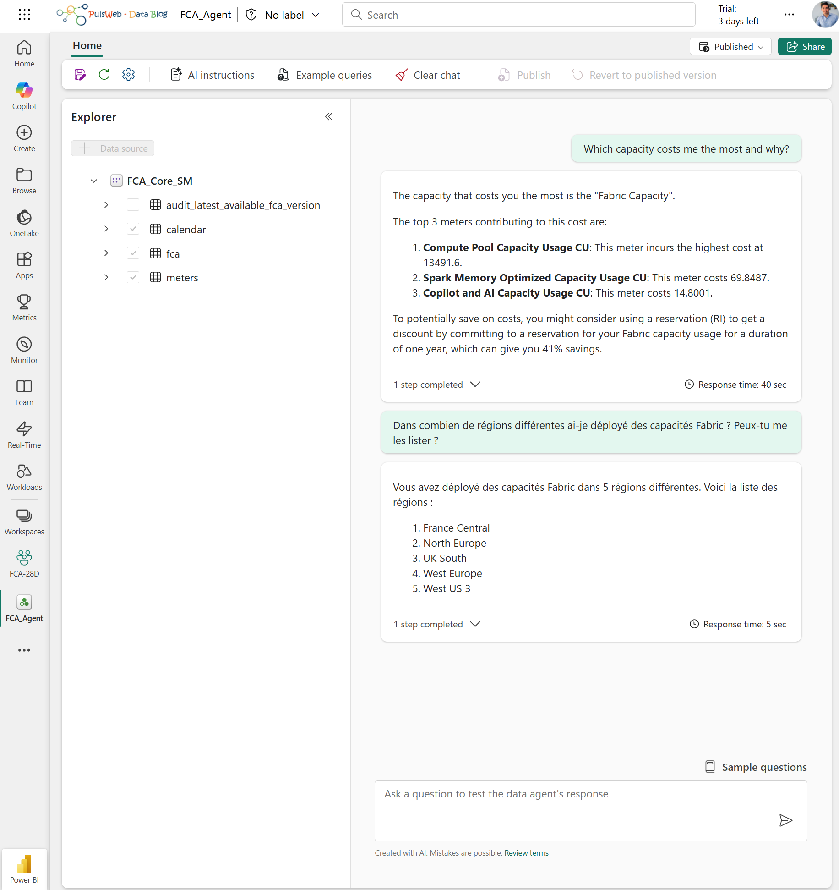

And from Teams:

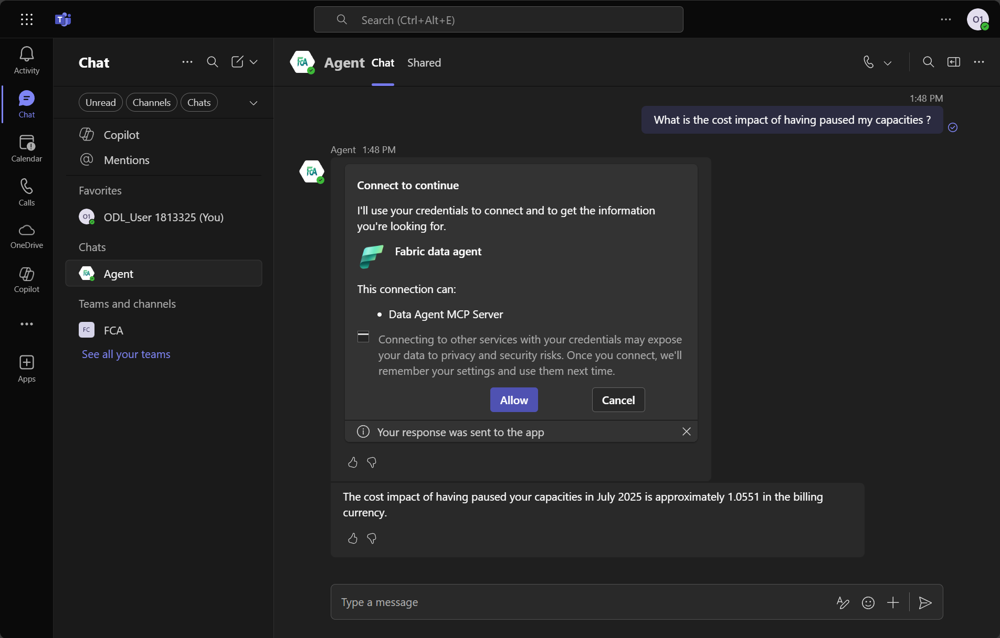

## Setup

🏃‍♂️‍➡️ Are you ready to try FCA? Let's follow these simple steps:

### 1 - Configure export

#### 1.1 - FOCUS Data

ℹ️ FCA will retain only data related to Fabric costs, no other Azure cost will be kept.

> To create an export (Create [Cost Management exports](https://learn.microsoft.com/en-us/azure/cost-management-billing/costs/tutorial-improved-exports#create-exports)) the [Cost Management Contributor role](https://learn.microsoft.com/en-us/azure/cost-management-billing/costs/understand-work-scopes#roles-used-in-cost-management-on-rbac-scopes) will be required.

An Azure Data Lake Storage Gen2 is necessary for saving exported data, the following steps outline how to create a storage account: [Create a storage account](https://learn.microsoft.com/en-us/azure/storage/blobs/create-data-lake-storage-account).

Once Data Lake Gen 2 storage account created here are the high levels steps to create an export:
- Sign into the Azure portal at [https://portal.azure.com](https://portal.azure.com/), search for **Cost Management**
- Select the required scope and select **Exports** in the left navigation menu
- Select **+ Create**
- On the Basics tab, select the template = **Cost and usage (FOCUS)**

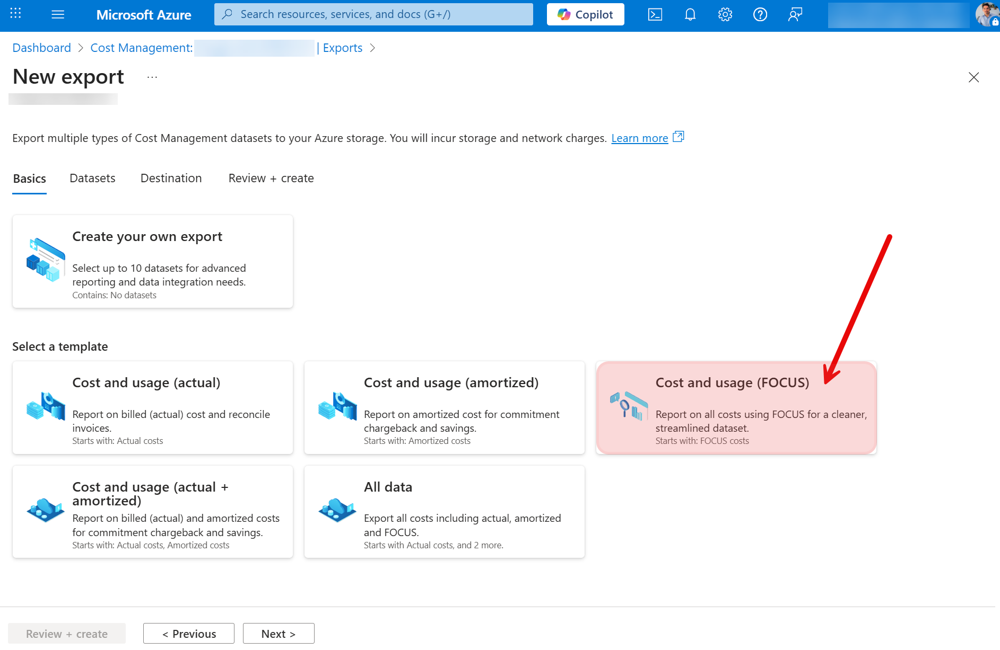

- On the Datasets tab, fill in **Export prefix** with "fca"
- On the Destination tab, select:
  - Storage type = **Azure blob storage**
  - Destination and storage = **Use existing**
  - Subscription = Your subscription
  - Storage account = Your storage account
  - Container = **fca**
  - Directory = **fca**
  - Format = **Parquet**
  - Compression type = **Snappy**
  - Overwrite data = **Enabled**

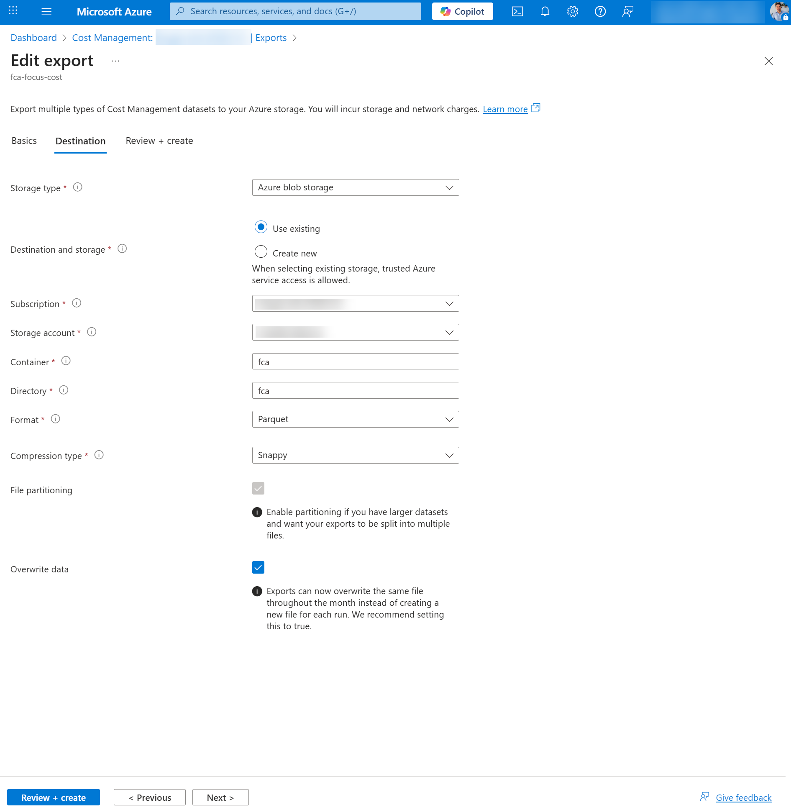

- On the Review + Create tab, select **Create**
- Run the export by selecting **Run now** on the export page

#### 1.2 - (Optional) Reservation Data

ℹ️ Reservation Data are not already used within this first Preview Version release.

To create reservation export, on the Azure portal , search for **Cost Management**
- Select the required scope and select **Exports** in the left navigation menu
- Select **+ Create**
- On the Basics tab, select the template = **All reservation data**
- On the Datasets tab, fill in **Export prefix** with "fca"
- On the Destination tab, select:
  - Storage type = **Azure blob storage**
  - Destination and storage = **Use existing**
  - Subscription = Your subscription
  - Storage account = Your storage account
  - Container = **fca**
  - Directory = **reservation**
  - Format = **csv**
  - Compression type = **none**
  - Overwrite data = **Enabled**
- On the Review + Create tab, select **Create**
- Run the export by selecting **Run now** on the export page

 ℹ️ When performing the export, you have the option to retrieve one year of historical data in one-month chunks.

### 2 - Configure Fabric items

- Create a new workspace "FCA" (name can be changed), which is backed by a P or F-capacity
- Download the ([Workspace logo](./media/FCA%20Logo%20Small.png)) and add the logo to the workspace
- Download and import the **[00_Deploy_FCA.ipynb](./script/00_Deploy_FCA.ipynb)** Notebook into your FCA workspace ([Import existing notebooks](https://learn.microsoft.com/en-us/fabric/data-engineering/how-to-use-notebook#import-existing-notebooks))
- Click "Run All" in the Notebook

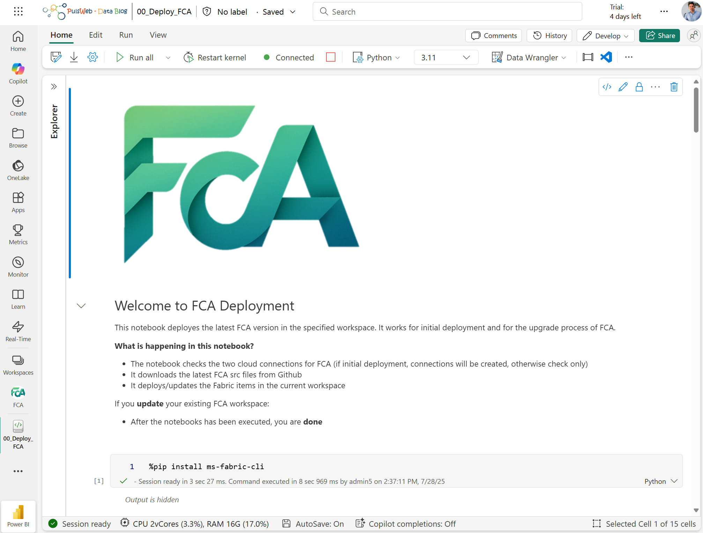

- Navigate to your FCA Workspace and refresh the browser to view the newly created artifacts

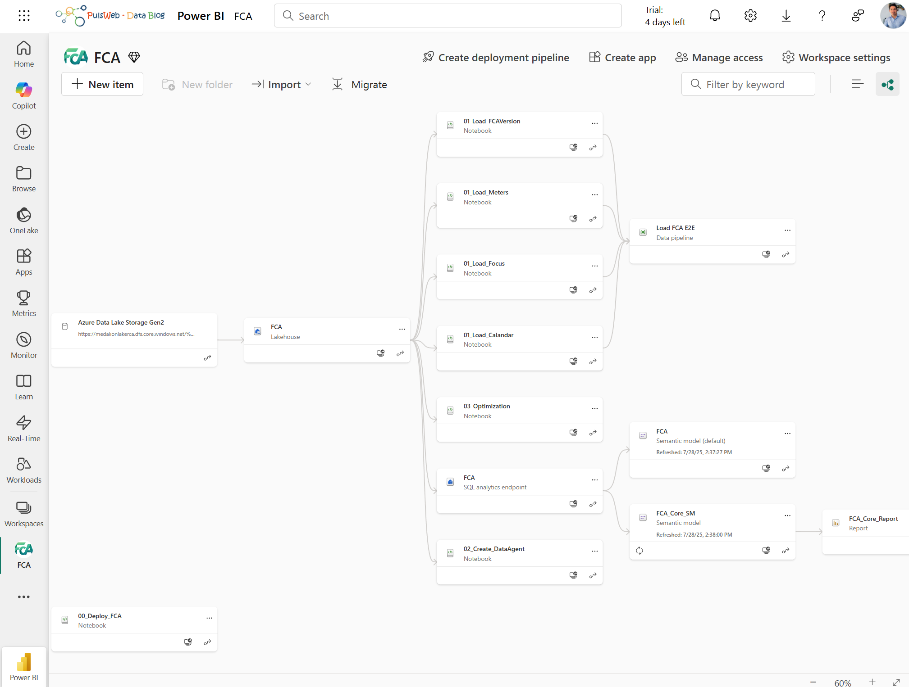

- Create a new File Shortcut on the FCA Lakehouse ([Create an Azure Data Lake Storage Gen2 shortcut](https://learn.microsoft.com/en-us/fabric/onelake/create-adls-shortcut))
  - Select the ellipsis (**...**) next to **Files**
  - Select **New shortcut**
  - Select Azure Data Lake Storage Gen 2 and provide the following settings:
    - URL = **Data Lake Storage** URL of the Data Lake storage account. To get the Data Lake Storage URL, view the storage account where the export created a directory and the FOCUS cost file. Under **Settings**, select **Endpoints**. Copy the URL marked as **Data Lake Storage** it should look like this: *https://###.dfs.core.windows.net*.
    - Connection = **Create a new connection**
    - Connection name = <*Any name of your choice*>
    - Authentication kind = **Organizational account**
    - Sign in when prompted and select the Shortcut target sub path **fca-focus-cost** and click on Next (⚠️ Ensure the selected hierarchy is correct)

- Rename the Shortcut to **focuscost** and click on Create

- Verify access to the data

### 3 - Run the Pipeline

- Open the **Load FCA E2E** Data pipeline and Run the Pipeline once

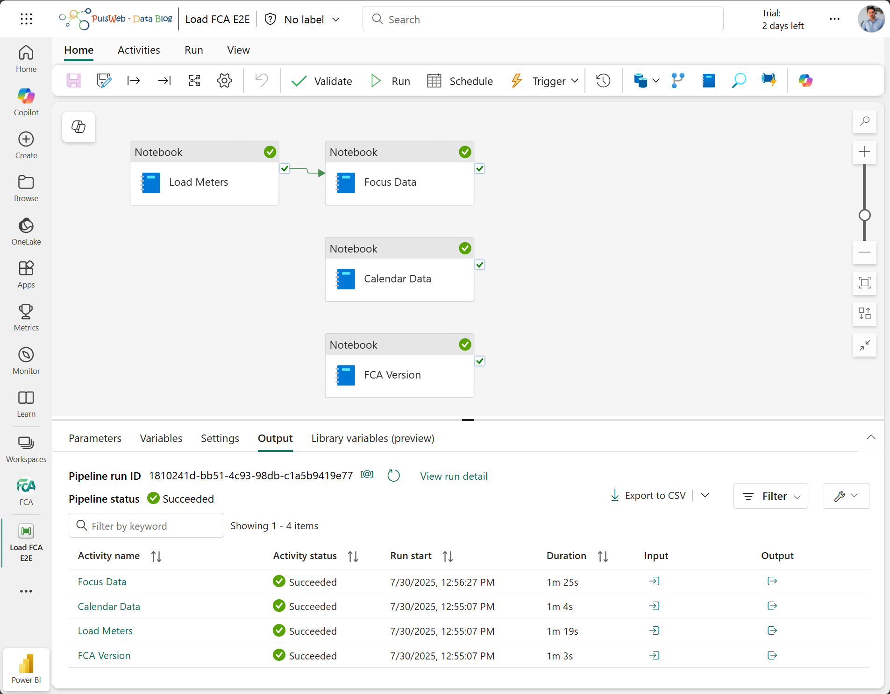

ℹ️ The parameters "FromMonth" and "ToMonth" in the Data pipeline can be configured to specify the historical time frame of data processing. For example, setting FromMonth = -3 and ToMonth = 0 will load data from the previous three months.

The pipeline can be scheduled for daily loads ([Scheduled data pipeline runs](https://learn.microsoft.com/en-us/fabric/data-factory/pipeline-runs#scheduled-data-pipeline-runs)).
In case of **Daily runs**, configure "FromMonth" = 0 and "ToMonth" = 0.
In case of **Weekly or Monthly runs**, configure "FromMonth" = -1 and "ToMonth" = 0.

### 4 - Open the report

- Navigate to your FCA workspace.

- Search for the item FCA_Core_Report.

- Open the FCA_Core_Report Power BI report.

- Feel free to explore the report pages

ℹ️ Refresh the SQL Endpoint of the Lakehouse and update the semantic model in case of errors.

### 5 - (Optional) Create the Data Agent

Since it's required additional prerequisites, the creation of the Data Agent is optional ([Data Agent prerequisites](https://learn.microsoft.com/en-us/fabric/data-science/how-to-create-data-agent#prerequisites)).

Steps to create the Data Agent:
- Open the **02_Create_DataAgent** Notebook
- Click "Run All" in the Notebook
- Navigate to your FCA Workspace and refresh the browser to view the newly created artifact *FCA_Agent* and open it to chat with your data
- Enhance custom agents in Microsoft Copilot Studio by leveraging insights from FCA Fabric Data Agent and chat in Teams, as demonstrated in following video: https://www.youtube.com/watch?v=GCtk2HPxZi8

## Update

To update FCA (Fabric Cost Analysis) to the latest version, follow the documented steps below.

☑️ Check the release notes of FCA to see enhanced, fixed, or new items and features: [FCA Release notes](https://github.com/microsoft/fabric-toolbox/blob/main/monitoring/fabric-cost-analysis/changelog/README.md)

🚩 Important:

- Updates overwrite all FCA provided items based on the item’s name
- Updates do not affect your collected data within the Lakehouse only the metadata will be overwritten
- If you have made custom changes to pipelines, notebooks, semantic models, and reports, please create a backup or rename your custom items
- Use the same user to update FCA as you used during the initial deployment. It is important to do so because this user is the owner of all the related items

Steps to update:

- 1 - Download the latest version of the **[00_Deploy_FCA.ipynb](./script/00_Deploy_FCA.ipynb)** Notebook
- 2 - Remove the old "00_Deploy_FCA" Notebook from your workspace
- 3 - Import the updated notebook into your FCA workspace
- 4 - Run the 00_Deploy_FCA.ipynb Notebook
- 5 - Update Pipeline parameters
- 6 - Open PBI report

ℹ️ This notebook is designed to initially deploy or update all the items in your FCA workspace. You do not need to manually run the Load FCA E2E pipeline after an update. During the next pipeline run, FCA will also check and update the status of your FCA version on the first page of the FCA_Core_Report:

## Support

The FCA solution accelerator template is not an official Microsoft service.

Ideas/Suggestions: Submit ideas and suggestions as issues in this repository.

Bug Reports: A backlog is maintained on the project issues page. If you encounter problems or have suggestions, add an entry to the issues section.

Important: Support tickets should not be opened for issues related to these templates. For any questions or concerns about the templates, create an issue in this repository.
