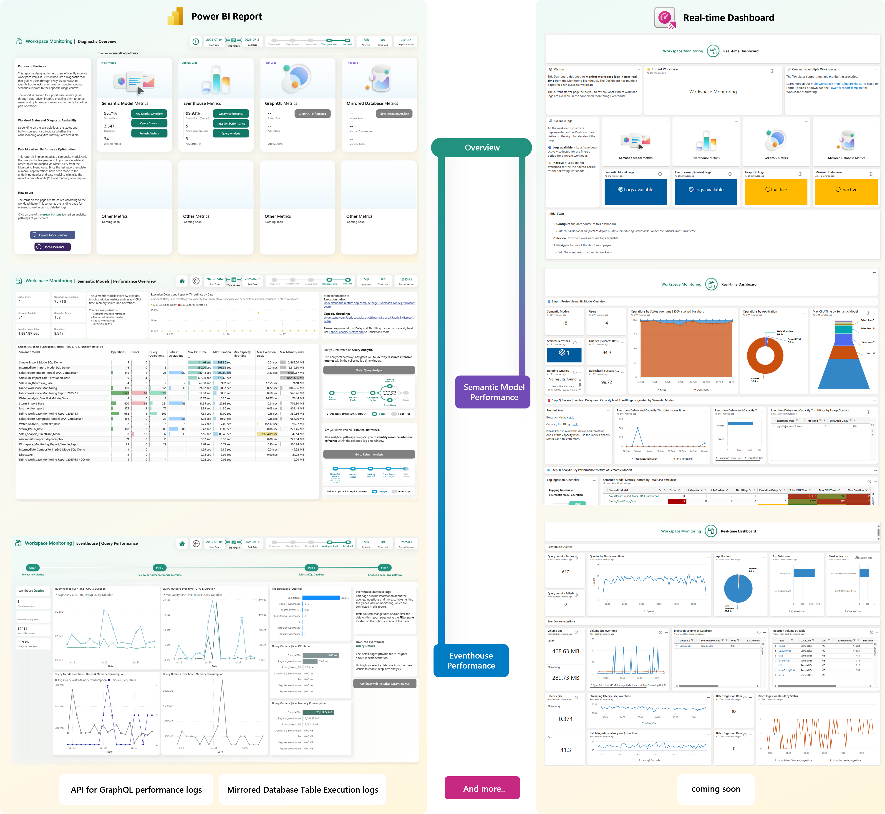
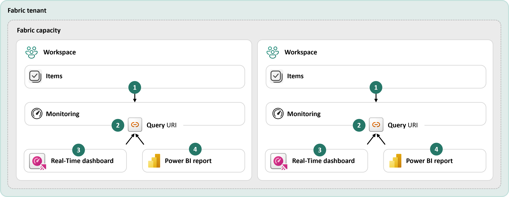
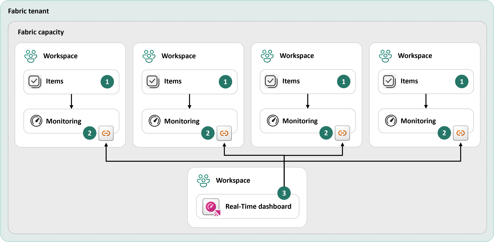
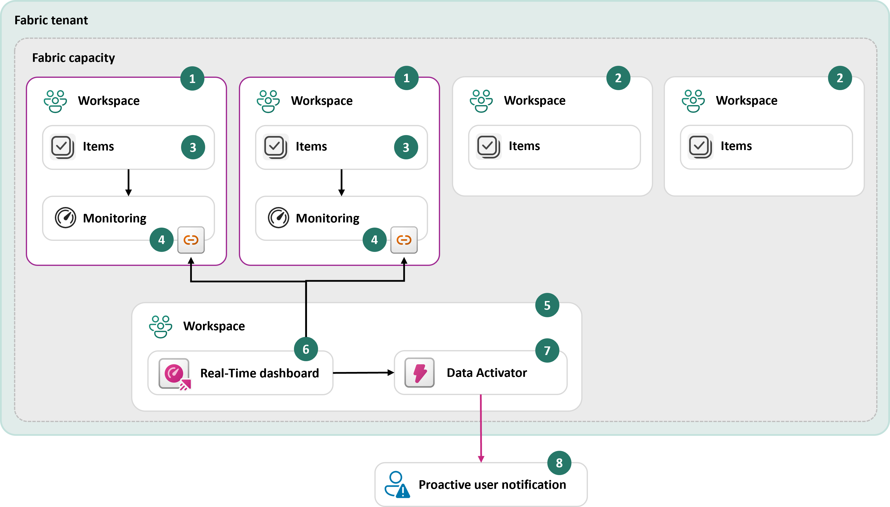

# Fabric Workspace Monitoring Report templates

Current template version: **2025.8.1**

## Introduction

### Workspace Monitoring
Large data solutions typically generate disparate and complicated data that can be difficult to converge into a single view. Workspace Monitoring provides a seamless, consistent experience with end-to-end visibility across Fabric workloads. 

Fabric Workspace Monitoring enables users to correlate events from origination to subsequent operations and queries across Fabric experiences and services.

Workspace Monitoring is a built-in solution that enables users to

- drive root-cause analysis
- analyze historical logs
- detect anomalies

When Workspace Monitoring is enabled at the workspace level, the workspace will start sending the selected diagnostics to a KQL database within Fabric that can be queried using KQL or SQL.

----------- 

## Templates
**for Workspace Monitoring**

This module of the Fabric toolbox provides a set of pre-built reports (Real-Time Dashboard and Power BI Report) on top of the Fabric Workspace Monitoring feature to be able to easily monitor your workspace from day one.

There are two monitoring template options available:

| Power BI Report template | Real-Time Dashboard template |
| ------ | ------ | 
| This template has been designed like a diagnostic tool. The UI helps you to navigate through with a top-bottom analytical approach, to get detailed historical trace logs from the supported Fabric items. | This template allows users to track workspace activities in real-time. It provides an operational tool for users to analyze issues within seconds, and zoom in to exact time periods that an event occured. |
| [How to deploy **PBI Report**](./how-to/How_to_deploy_Workspace_Monitoring_PBI_Report.md) | [How to deploy **RTI Dashboard**](./how-to/How_to_deploy_Workspace_Monitoring_RTI_Dashboard.md) |
| [Documentation to **PBI Report**](./documentation/Workspace_Monitoring_PBI_Report.md) | [Documentation to **RTI Dashboard**](./documentation/Workspace_Monitoring_RTI_Dashboard.md)  |
|**Included trace logs:** Semantic Models, Eventhouse Databases, Mirrored Databases, API for GraphQL | **Included trace logs:** Semantic Models, Eventhouse Databases | 
|**Connectivity mode:** Composite mode (helper tables are imported, other trace logs are direct query) | **Connectivity mode:** each visual queries individually the Monitoring Eventhouse data|
| **Main benefits:** Analysing performance trends over time, deep dive investigations about historical operations, queries, etc.| **Main benefits:** Tracking current/running operations, enabling pro-active alerting based on pre-defined scenarios. |

------------------------

### Deployment scenarios

In the current version of the Workspace Monitoring, the feature can be enabled on workspace level. However the templates has been designed with support of multiple workspaces.

| Scenario | Primary Audience | Recommended templates & features |
| ------ | ------ | ------ |
| A) **Single Workspace** deployment (one-to-one)       |    Workspace Administrators, Pro developers focusing on one single workspace.    |   Real-Time Dashboard, Power BI Report     |
| B) **Multiple Workspace** deployment (one-to-many)       |    Workspace Administrators, Capacity Owners, Domain Administrators focusing on sub-set of workspaces.    |    Real-Time Dashboard    |
| C) Deployment for **critical workloads**       |    Data Product Owners, Workspace Owners    |    Real-Time Dashboard + Data Activator    |
| D) **Integration with FUAM**       |    Fabric Administrators, Capacity Owners    |    Power BI Report    |

#### A) Single Workspace deployment (one-to-one)

In this scenario, the templates can be published in the same workspace next to the customer workload.

|Item|Description|
|--|--|
|1|Once the Workspace Monitoring feature has been enabled for the workspace, the feature will stream the collected trace logs to the Monitoring Eventhouse KQL database.|
|2|The Monitoring Eventhouse KQL database provides a Query URI endpoint, which will be used by the templates. The user can configure the Query URI endpoint manually by changing the paramaters in the template |
|3| The Real-Time Dashboard template can be published into the given workspace by the user.|
|4| The Power BI report template can be imported into the given workspace by the user.|

**Primary audience:** Workspace Administrators, Pro developers focusing on one single workspace.

**Recommended templates:**
- Real-Time Dashboard
- Power BI Report

-------- 

#### B) Multiple Workspace deployment (one-to-many)

In this scenario, the templates can be published in one "central" workspace, which helps to isolate the customer workload from the monitoring templates.

|Item|Description|
|--|--|
|1|Once the Workspace Monitoring feature has been enabled for the workspace, the feature will stream the collected trace logs to the Monitoring Eventhouse KQL database.|
|2|The Monitoring Eventhouse KQL database provides a Query URI endpoint, which will be used by the templates. The user can configure the Query URI endpoint manually by changing the paramaters in the template. |
|3| The Real-Time Dashboard template can be published into the given workspace by the user. We recommend to use this template, because changing the parameters (QueryURI) can happen directly on the UI of the dashboard by the user.|

**Primary audience:** Workspace Administrators, Capacity Owners, Domain Administrators focusing on sub-set of workspaces.

**Recommended templates:**
- Real-Time Dashboard

-------- 
#### C) Deployment for critical workloads

In this scenario, the template will be deployed in a separated workspace (attached to an F-SKU) for monitoring purposes.
This workspaces can contain the Real-Time Dashboard with multiple Datasources (Monitoring Eventhouses from multiple Workspaces) and a pro-active alerting solution can be configured. 

We recommend this deployment scenario, whenever a high critical workload has to be monitored in near-real-time for one or multiple workspaces.

|Item|Description|
|--|--|
|1|Let's assume you have identified workspaces with high criticality in your organisation, which requires a continuosly monitoring. In this scenario these sub-set of your workspaces will be configured and extended with the Workspace Monitoring feature and the templates.|
|2|Let's assume you have other workspaces, which are out of scope in this scenario.|
|3|Once the Workspace Monitoring feature has been enabled for the workspace, the feature will stream the collected trace logs to the Monitoring Eventhouse KQL database.|
|4|The Monitoring Eventhouse KQL database provides a Query URI endpoint, which will be used by the templates. The user can configure the Query URI endpoint manually by changing the paramaters in the template.|
|5|In this scenario, there is a separat workspace, which the user creates to store the monitoring templates only.|
|6|The Real-Time Dashboard template can be published into this separat workspace by the user. We recommend to use this template, because changing the parameters (QueryURI) can happen directly on the UI of the dashboard by the user.|
|7|Optionally, a set of rules can be configured based on the Real-Time Dashboard within a Data Activator item, which sends proactivelly notifications about peaks, anomalies, long-running operations with high CPU, Memory consumption.|
|8|User, team of people will be notified in near-real-time to be able to take action on the alerted items.|

**Primary audience:** Data Product Owners, Workspace Owners

**Recommended templates & features:**
- Real-Time Dashboard + Data Activator

-------- 
#### D) Integration with FUAM
The other solution accelerator within the Fabric toolbox is FUAM (Fabric Unified Admin Monitoring), which aims a tenant level monitoring of your environment. Note that FUAM requires Fabric Administrator EntraID rights.

**Primary audience:** Fabric Administrators, Capacity Owners

**Recommended templates:**
- Power BI Report

### 

------------------------

## Considerations and limitations

#### Support of the templates

- The Workspace Monitoring feature itself is Microsoft Fabric feature
- The Templates from this repository page is a solution accelerator, which is not an official Microsoft asset/service.

#### Capacity consumption of Workspace Monitoring feature with templates
Similarly like before, the end-to-end solution should be considered in two parts:
1) **Workspace Monitoring feature**
2) **Templates** for Workspace Monitoring 

The CU consumption of **feature (point 1)** can be evaluated based on the following operations by item kind:
- **Eventhouse:**
    - Eventhouse UpTime
- **Eventstream:**
    - Eventstream Per Hour
    - Eventstream Data Traffic Per GB
    - Eventstream Connector Per vCore-hour
    - Eventstream Processor Per Hour

The CU consumption of the **templates (point 2)** can be evaluated based on the following operations by item kind:
- **Real-Time Dashboard:**
    - OneLake Write via Proxy
    - OneLake Read via Proxy
    - OneLake Other Operations
- **Semantic Model:**
    - Query
    - Dataset Scheduled Refresh

#### Power BI report template
- The Power BI report template has been optimised and refactored since the last version. It uses now DirectQuery for the large transactional tables like 'SemanticModelLogs' or 'Eventhouse Metrics', which enables users to analyse big workspaces.
- If you are facing issues with the template, please raise an issue in this Github repository.

------------------------

## Remarks

**Capacity utilization:**
Please note that the **report templates** and the items of the  Workspace Monitoring **are utilizing CU of your capacity.**
The Workspace Monitoring feature is not charged during public preview.

**CPU & Memory metrics in Monitoring Eventhouse and templates:**
Please note that the CPU and Memory related metrics are **not aggregated, smoothed or bursted, like the operations in the Microsoft Fabric Capacity Metrics App**. A one-to-one comparison is for different reasons not possible. Billable capacity utilization and storage information are shown in the Microsoft Fabric Capacity Metrics App. https://learn.microsoft.com/en-us/fabric/enterprise/metrics-app

Please test the solution on a non-production Fabric SKU first without impacting other workloads on your tenant.

------------------------

## Support
These templates (Real-Time Dashboard template and Power BI template) **are not official Microsoft services**. 

**Ideas/Suggestions:**
Submit your ideas and suggestions as an issue in this repository.

**Bug Reports:** 
We maintain a backlog in the project issues page. Let us know if you run into any problems or share your suggestions by adding an entry into the issues section.

**Important**
Please, **do not** open a support ticket in case of an issue regarding the templates.
In case of any questions, issues regarding the templates, please **create an issue in this repository.**

For more information, please visit the main page of this repository or the learn.microsoft.com website.

------------------------
## Trademarks
This project may contain trademarks or logos for projects, products, or services. Authorized use of Microsoft trademarks or logos is subject to and must follow Microsoft's Trademark & Brand Guidelines. Use of Microsoft trademarks or logos in modified versions of this project must not cause confusion or imply Microsoft sponsorship. Any use of third-party trademarks or logos are subject to those third-party's policies.
