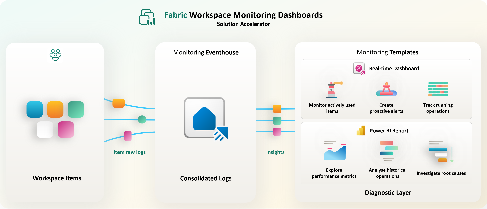
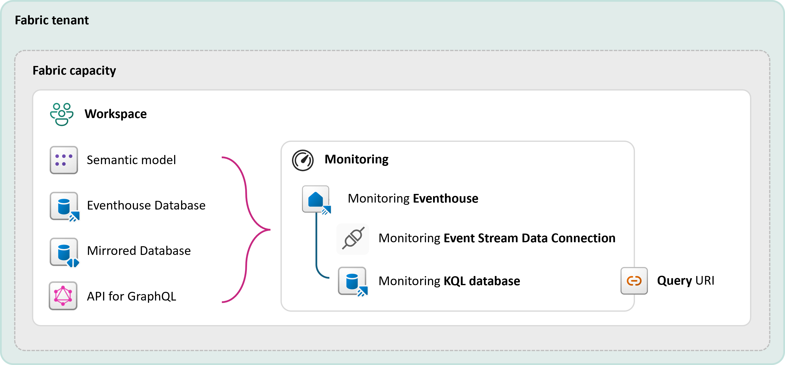

# Fabric Workspace Monitoring Report templates (preview)

Current template version: **2025.8.1**

## Introduction

### Workspace Monitoring (preview)
Large data solutions typically generate disparate and complicated data that can be difficult to converge into a single view. 
Workspace Monitoring provides a seamless, consistent experience with end-to-end visibility across Fabric workloads. 

Fabric Workspace Monitoring enables users to correlate events from origination to subsequent operations and queries across Fabric experiences and services.

Workspace Monitoring is a built-in solution that enables users to

- drive root-cause analysis
- analyze historical logs
- detect anomalies

When Workspace Monitoring is enabled at the workspace level, the workspace will start sending the selected diagnostics to a KQL database within Fabric that can be queried using KQL or SQL.

----------- 

## Templates
**for Workspace Monitoring**

This module of the Fabric toolbox provides a set of pre-built reports (Real-Time Dashboard and Power BI Report) on top of the Fabric Workspace Monitoring feature to be able to easily monitor your workspace from day one.

There are two monitoring template options available:

| Power BI Report | Real-Time Dashboard |
| ------ | ------ | 
| This template has been designed like a Diagnostic tool. The UI helps you to navigate through with a top-bottom analytical approach, to get detailed historical trace logs from the supported Fabric items. | This template allows users to track workspace activities in real-time. It provides an operational tool for users to analyze issues within seconds, and zoom in to exact time periods that an event occured. |
| [How to deploy **PBI Report**](./how-to/How_to_deploy_Workspace_Monitoring_PBI_Report.md) | [How to deploy **RTI Dashboard**](./how-to/How_to_deploy_Workspace_Monitoring_RTI_Dashboard.md) |
| [Documentation to **PBI Report**](./documentation/Workspace_Monitoring_PBI_Report.md) | [Documentation to **RTI Dashboard**](./documentation/Workspace_Monitoring_RTI_Dashboard.md)  |

The templates gather and visualizes collected trace logs from Monitoring Eventhouse for the following items:
- Semantic Model
- Eventhouse Database
- Mirrored Database
- API for GraphQL

------------------------

### Deployment scenarios

#### General

In the current version of the Workspace Monitoring, the feature can be enabled on workspace level. However the templates has been designed with support of multiple workspaces.

| Scenario | Primary Audience | Recommended templates & features |
| ------ | ------ | ------ |
| A) **Single Workspace** deployment (one-to-one)       |    Workspace Administrators, Pro developers focusing on one single workspace.    |   Real-Time Dashboard, Power BI Report     |
| B) **Multiple Workspace** deployment (one-to-many)       |    Workspace Administrators, Capacity Owners, Domain Administrators focusing on sub-set of workspaces.    |    Real-Time Dashboard    |
| C) **Critical Workloads**       |    Data Product Owners, Workspace Owners    |    Real-Time Dashboard + Data Activator    |
| D) **Integration with FUAM**       |    Fabric Administrators, Capacity Owners    |    Power BI Report    |

#### Scenario discussion

##### A) Single Workspace deployment (one-to-one)

In this scenario, the templates can be published in the same workspace next to the customer workload.

**Primary audience:** Workspace Administrators, Pro developers focusing on one single workspace.

**Recommended templates:**
- Real-Time Dashboard
- Power BI Report

-------- 

##### B) Multiple Workspace deployment (one-to-many)

In this scenario, the templates can be published in one "central" workspace, which helps to isolate the customer workload from the monitoring templates.

**Primary audience:** Workspace Administrators, Capacity Owners, Domain Administrators focusing on sub-set of workspaces.

**Recommended templates:**
- Real-Time Dashboard

-------- 
##### C) Critical Workloads

In this scenario, the template will be deployed in a separated workspace (attached to an F-SKU) for monitoring purposes.
This workspaces can contain the Real-Time Dashboard with multiple Datasources (Monitoring Eventhouses from multiple Workspaces) and a pro-active alerting solution can be configured. 

We recommend this deployment scenario, whenever a high critical workload has to be monitored in near-real-time.

**Primary audience:** Data Product Owners, Workspace Owners

**Recommended templates & features:**
- Real-Time Dashboard + Data Activator

-------- 
##### D) Integration with FUAM
The other solution accelerator within the Fabric toolbox is FUAM (Fabric Unified Admin Monitoring), which aims a tenant level monitoring of your environment. Note that FUAM requires Fabric Administrator EntraID rights.

**Primary audience:** Fabric Administrators, Capacity Owners

**Recommended templates:**
- Power BI Report

### 

------------------------

## Considerations and limitations

**Power BI report template**
- **Eventhouse Query Limits**
    - If the template refresh fails due to the data volume, you can filter the data by configuring the Fabric Item Id parameter.

------------------------

## Remarks

**Capacity utilization:**
Please note that the **report templates** and the items of the  Workspace Monitoring **are utilizing CU of your capacity.**
The Workspace Monitoring feature is not charged during public preview.

**CPU & Memory metrics in Monitoring Eventhouse and templates:**
Please note that the CPU and Memory related metrics are **not aggregated, smoothed or bursted, like the operations in the Microsoft Fabric Capacity Metrics App**. A one-to-one comparison is for different reasons not possible. Billable capacity utilization and storage information are shown in the Microsoft Fabric Capacity Metrics App. https://learn.microsoft.com/en-us/fabric/enterprise/metrics-app

Please test the solution on a non-production Fabric SKU first without impacting other workloads on your tenant.

------------------------

## Support
These templates (Real-Time Dashboard template and Power BI template) **are not official Microsoft services**. 

**Ideas/Suggestions:**
Submit your ideas and suggestions as an issue in this repository.

**Bug Reports:** 
We maintain a backlog in the project issues page. Let us know if you run into any problems or share your suggestions by adding an entry into the issues section.

**Important**
Please, **do not** open a support ticket in case of an issue regarding the templates.
In case of any questions, issues regarding the templates, please **create an issue in this repository.**

For more information, please visit the main page of this repository or the learn.microsoft.com website.

------------------------
## Trademarks
This project may contain trademarks or logos for projects, products, or services. Authorized use of Microsoft trademarks or logos is subject to and must follow Microsoft's Trademark & Brand Guidelines. Use of Microsoft trademarks or logos in modified versions of this project must not cause confusion or imply Microsoft sponsorship. Any use of third-party trademarks or logos are subject to those third-party's policies.
